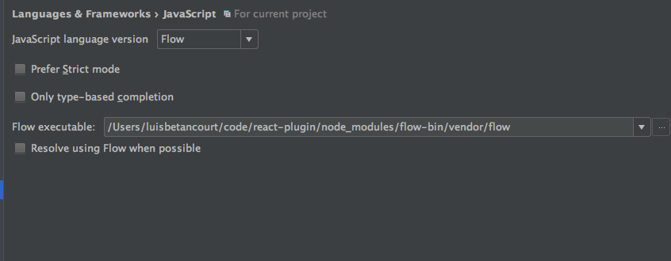

# Redux boilerplate

### Getting started ###

```
    npm i
    npm start
```

### Features ###
1. eslint AirBnB
2. flow
3. scss, css loaders
4. redux
5. react-router

## Data structures ##
1. ImmutableJs

### eslint setup ###
To use es-lint in webstorm:


### Flow + webstorm setup ###
To use in webstorm:



### Flow + webpack setup ###
`npm i --save-dev flow-status-webpack-plugin babel-plugin-typecheck
`
Add this to  the .babelrc file to enable checking types.
```
"plugins": [
    [
      "typecheck",
      {
        "disable": {
          "production": true
        }
      }
    ]
  ]
```

webpack.config.js
```
const FlowStatusWebpackPlugin = require('flow-status-webpack-plugin');
const flowConfig = {
  restartFlow: true,
  binaryPath: path.join(__dirname, 'node_modules', 'flow-bin', 'vendor', 'flow'),
};

```

Add new plugins array inside the webpack config file.
```
module.exports = {
  plugins: [
    new FlowStatusWebpackPlugin(flowConfig),
  ]
}
```

create a new .flowconfig file in ./ and add the following text.
```
[ignore]
.*/test/.*
.*\.ignore\.js

[options]
esproposal.class_static_fields=enable
esproposal.class_instance_fields=enable
```

Add this to scripts in package.json file.
 ```
 "flow": "./node_modules/flow-bin/vendor/flow; test $? -eq 0 -o $? -eq 2"
 ```

Adding immutablejs flow types:
Add this to .flowconfig

 ```
 [libs]
 .*/node_modules/immutable/dist/immutable.js.flow
 ```